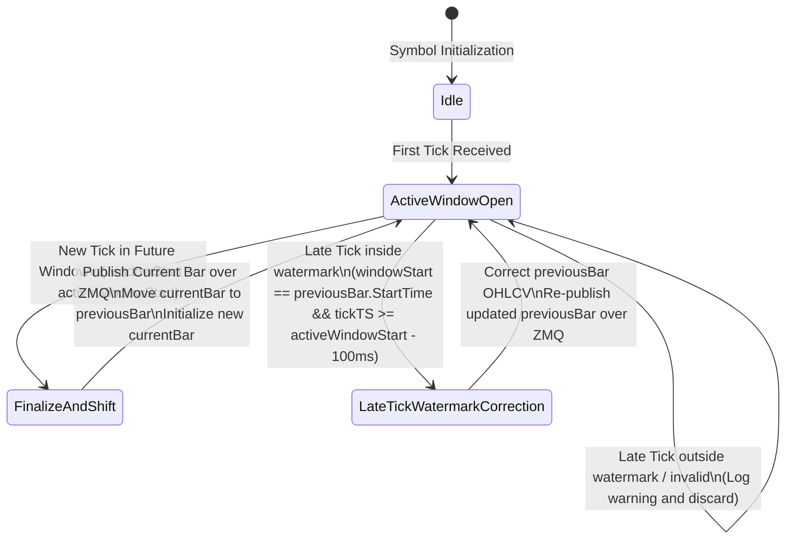

# TESTING.md - K-Line Bar Aggregator Testing Strategy

This document describes the testing strategy, verification matrices, state transitions, and concurrency topology for the K-Line Bar Aggregator (`cmd/bar_aggregator`).

---

## 1. Deterministic Event Replay Matrix

The unit tests in `main_test.go` utilize a deterministic sequence of simulated market ticks (Event-Time) to verify window slicing, boundary handling, watermark latency correction, and late-tick discarding.

| Sequence ID | Symbol | Timestamp (Event-Time Offset) | Price | Size | Expected Action / State Transition |
|-------------|--------|-------------------------------|-------|------|------------------------------------|
| **1 (Tick A)** | AAPL   | `T_0` (10:01:10)             | 100.0 | 10.0 | **Window Created**: AAPL 10:01:00 window initialized. Active: `O=100.0, H=100.0, L=100.0, C=100.0, V=10.0`. |
| **2 (Tick B)** | AAPL   | `T_0 + 20s` (10:01:30)        | 105.0 | 15.0 | **Active Bar Update**: High updated to 105.0. Volume accumulated. Active: `O=100.0, H=105.0, L=100.0, C=105.0, V=25.0`. |
| **3 (Tick C)** | AAPL   | `T_0 + 35s` (10:01:45)        | 98.0  | 5.0  | **Active Bar Update**: Low updated to 98.0, Close updated to 98.0. Active: `O=100.0, H=105.0, L=98.0, C=98.0, V=30.0`. |
| **4 (Tick D)** | AAPL   | `T_0 + 55s` (10:02:05)        | 101.0 | 20.0 | **Forward Shift & Publish**: Triggered by event time crossing boundary. 10:01:00 bar finalized and published over ZMQ. New 10:02:00 window initialized: `O=101.0, H=101.0, L=101.0, C=101.0, V=20.0`. |
| **5 (Tick E)** | AAPL   | `T_0 + 49.95s` (10:01:59.950) | 97.0  | 10.0 | **Late Tick / Watermark Update**: Tick timestamp is within the 100ms watermark threshold (`tick_ts >= 10:02:00 - 100ms`). 10:01:00 bar updated in-memory (`L=97.0, C=97.0, V=40.0`) and re-published. |
| **6 (Tick F)** | AAPL   | `T_0 + 49.0s` (10:01:59.000)  | 90.0  | 10.0 | **Discard**: Out-of-watermark tick (`tick_ts < 10:02:00 - 100ms`). Safety log generated, no updates, no ZMQ publication. |

---

## 2. State Transfer Diagram

The aggregator is entirely event-driven. The state transitions are managed per symbol as follows:



---

## 3. Concurrency Hashing Topology

To avoid synchronization lock overhead across thousands of concurrently active ticker symbols, `bar_aggregator` implements an lock-free execution model based on **Symbol Hashing Router Channels**. 

```
                                 ZeroMQ TICK.* Stream
                                           │
                                           ▼
                                ┌──────────────────────┐
                                │  zmq4.Sub Ingestion  │
                                └──────────┬───────────┘
                                           │
                                           ▼
                            ┌──────────────────────────────┐
                            │      Symbol Hash Router      │
                            │ (Manager: getOrCreateAgg)   │
                            └──────┬──────────────┬────────┘
                                   │              │
                    AAPL / TSLA... │              │ MSFT / AMZN...
                                   ▼              ▼
                            ┌────────────┐  ┌────────────┐
                            │  Channel   │  │  Channel   │
                            │ (Symbol A) │  │ (Symbol B) │
                            └─────┬──────┘  └─────┬──────┘
                                  │               │
                                  ▼               ▼
                            ┌────────────┐  ┌────────────┐
                            │ Goroutine  │  │ Goroutine  │
                            │(Aggregator)│  │(Aggregator)│
                            └─────┬──────┘  └─────┬──────┘
                                  │               │
                                  └───────┬───────┘
                                          │ Publish BAR.<Symbol>
                                          ▼
                                ┌──────────────────────┐
                                │   zmq4.Pub Socket    │
                                └──────────────────────┘
```

### Key Concurrency Principles:
1. **Single-Writer Constraint (Actor Pattern)**: Each symbol has a dedicated `SymbolAggregator` struct executing in its own background goroutine loop. This aggregator is the sole writer to its in-memory states (`currentBar` and `previousBar`). No shared memory write-locks are required.
2. **Channel-based Scheduling**: Ticks read from the main ZeroMQ socket subscription thread are routed to the target symbol aggregator by writing directly to its dedicated buffered channel (`tickChan`).
3. **Lock-Free Scaling**: The lock inside the manager `getOrCreateAggregator` is only contested when a *new* symbol is first seen to initialize its dedicated queue and goroutine. Under steady-state trading conditions, routing is non-blocking and lock-free, maximizing throughput.
