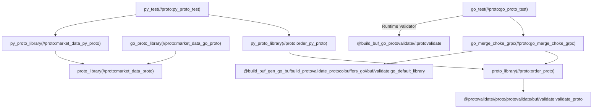

# Protocol Verification & Testing Documentation

This document describes the validation rules, dependency topology, and generated stub location mapping for the BullDog Alpha platform's Phase 1 foundation components.

---

## 1. Field Boundary Matrix (字段边界矩阵)

This matrix outlines the specific validation constraints implemented in the protocol contracts (`proto/order.proto` and `proto/market_data.proto`) utilizing `buf.validate` and runtime validation.

| Message | Field | Go Type | Python Type | Physical / Logical Constraints | Example Valid | Example Invalid |
| :--- | :--- | :--- | :--- | :--- | :--- | :--- |
| **OrderRequest** | `order_id` | `string` | `str` | None (identifier) | `"ord-1002"` | N/A |
| | `symbol` | `string` | `str` | `^[A-Z]{1,5}$` (1 to 5 uppercase alphabetical characters) | `"AAPL"`, `"MSFT"` | `"aapl"` (lowercase), `"AAP1"` (numeric), `""` (empty) |
| | `price` | `float64` | `float` | `double.gt = 0` (strictly greater than zero) | `150.25` | `0.0`, `-10.5` |
| | `quantity` | `float64` | `float` | `double.gt = 0` (strictly greater than zero) | `100.0` | `0.0`, `-1.0` |
| | `side` | `OrderSide` | `enum` | Must be `BUY` or `SELL` | `OrderSide_BUY` | `ORDER_SIDE_UNSPECIFIED` |
| | `type` | `OrderType` | `enum` | Must be `LIMIT` or `MARKET` | `OrderType_LIMIT` | `ORDER_TYPE_UNSPECIFIED` |
| | `correlation_id`| `string` | `str` | None (tracing) | `"corr-uuid-1"` | N/A |
| **OrderResponse** | `order_id` | `string` | `str` | None | `"ord-1002"` | N/A |
| | `status` | `OrderStatus` | `enum` | Valid state enum | `OrderStatus_FILLED` | N/A |
| | `reason` | `string` | `str` | Explanation for rejection | `"INSUFFICIENT_FUNDS"` | N/A |
| | `correlation_id`| `string` | `str` | Tracing ID propagation | `"corr-uuid-1"` | N/A |
| **Position** | `symbol` | `string` | `str` | None | `"AAPL"` | N/A |
| | `quantity` | `float64` | `float` | Net positions (can be negative for shorts) | `-50.0`, `12.5` | N/A |
| | `average_entry_price`| `float64`| `float` | Price average | `145.60` | N/A |
| **EquityTick** | `symbol` | `string` | `str` | None | `"AAPL"` | N/A |
| | `price` | `float64` | `float` | None | `150.0` | N/A |
| | `size` | `float64` | `float` | None | `200.0` | N/A |
| | `timestamp` | `int64` | `int` | Millisecond-level epoch | `1685600000000` | N/A |
| | `correlation_id`| `string` | `str` | Tracing ID | `"corr-tick-uuid"` | N/A |
| **EquityBar** | `symbol` | `string` | `str` | None | `"AAPL"` | N/A |
| | `open` / `high` / `low` / `close` | `float64` | `float` | Bar pricing | `150.0` | N/A |
| | `volume` | `float64` | `float` | Total trade volume | `50000.0` | N/A |
| | `window_size` | `int64` | `int` | Window length (seconds) | `60` | N/A |
| | `timestamp` | `int64` | `int` | Epoch start time | `1685600000000` | N/A |

---

## 2. Bazel Dependency Topology (依赖拓扑图)

The build graph ensures that Go code generation uses hermetic toolchains, and Python code generation compiles successfully under Bazel 9.x.

---

## 3. Generated Stub Path Mapping (生成代码路径映射)

Since all targets build within the Bazel sandbox, outputs are populated in the virtual output structure `bazel-bin/`. Below are the mappings of generated code assets:

| Bazel Target | Generated File Location (from workspace root) | Target Platform / Package | Description |
| :--- | :--- | :--- | :--- |
| `//proto:market_data_go_proto` | `bazel-bin/proto/market_data_go_proto_/bulldog_alpha/proto/market_data/market_data.pb.go` | Go / `market_data` | Standard protobuf structures for market data |
| `//proto:go_merge_choke_grpc` | `bazel-bin/proto/go_merge_choke_grpc_/bulldog_alpha/proto/order/order.pb.go` | Go / `order` | Protobuf messages and gRPC services (OrderService, ControlService) |
| `//proto:market_data_py_proto` | `bazel-bin/proto/market_data_pb2.py` `bazel-bin/proto/market_data_pb2.pyi` | Python | Python message stub and typings stub for market data |
| `//proto:order_py_proto` | `bazel-bin/proto/order_pb2.py` `bazel-bin/proto/order_pb2.pyi` | Python | Python message stub and typings stub for order contracts |
