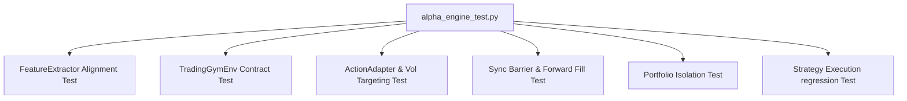

# Alpha Engine 测试指南 (TESTING.md)

本文档说明了 **BullDog Alpha** 策略引擎运行时与强化学习（RL）模块的测试架构、核心状态流转、以及执行指令。

## 1. 测试架构设计 (Testing Architecture)

我们的测试采用 **全密闭、零物理网络依赖** 的单元与回归测试体系，以保障编译和验证的确定性（Determinism）。



### 1.1 核心测试用例
1. **`test_feature_extractor_incremental_vs_batch`**
   - 验证 `FeatureExtractor` 在实盘流式 `push()` 模式下算出的观察特征，与回测中 Polars 批量向量化算出的特征在每一个历史 Bar 时点上完全二进制一致，最大差值绝对值满足 $\max(|x_{vec} - x_{step}|) \le 10^{-9}$。
2. **`test_feature_extractor_zero_volatility`**
   - 测试市场处于完全盘整无成交（波动率为 0）时的除零保护，断言滚动波动率被置为 $\epsilon = 10^{-8}$ 且不发生 NaN 逃逸。
3. **`test_trading_gym_env_contract`**
   - 验证 `TradingGymEnv` 状态机的重置幂等性、动作边界自动 Clip 机制、以及一期（1-step）执行延迟与 Pending 队列仿真。
4. **`test_action_adapter_filters_and_vol_targeting`**
   - 验证小于最小交易股数（`min_qty=5`）或最小金额（`min_value=100`）的动作被主动过滤拦截。
   - 验证在策略 NAV 波动率上升时，动态波动率目标制（Volatility Targeting）安全软锁能够同比例压降开仓权重。
5. **`test_sync_barrier_and_forward_fill`**
   - 验证 `StrategyOrchestrator` 多标的时间同步屏障。
   - 验证流动性空窗标的超时降级前向填充（Forward Fill）时，其 Volume 强制置为 0，价格以前收盘价继承，保障特征计算的微观纯净。
6. **`test_orchestrator_portfolio_isolation`**
   - 验证多策略并发下，各虚拟账户的可用资金和持仓严格物理隔离，发单互不侵扰。

---

## 2. 状态机流转与执行延迟 (Env State Machine)

`TradingGymEnv` 实现的是真实的 **1 步下单延迟模型**，避免模型高估当前 Bar 可成交价：

```
Step T 触发 (Action: target_weight)
  ├── 1. 读取当前 (T) Bar 的 Close 价格
  ├── 2. 处理上一期 (T-1) 遗留的 Pending 订单 -> 结算并扣减资金 (SubPortfolio)
  ├── 3. 计算从 T-1 到 T 净值 NAV 变化的 Log-Return -> 加上手续费与换手惩罚折算为 Reward_T
  ├── 4. 根据当前 target_weight 重新计算目标持仓数 -> 生成新订单加入 Pending 队列 (延后到 T+1 结算)
  └── 5. 状态指针推进到 T+1
```

---

## 3. 测试与覆盖率执行命令

### 3.1 运行 Bazel 单元测试
在 Monorepo 根目录下运行以下指令以进行密闭测试：
```bash
bazel test //src/alpha_engine:alpha_engine_test
```

### 3.2 运行代码覆盖率
使用 Bazel 自带的 Coverage 收集覆盖率：
```bash
bazel coverage //src/alpha_engine:alpha_engine_test --combined_report=lcov
```
LCOV 报告文件路径输出在 `/bazel-out/_coverage/_coverage_report.dat` 中。

---

## 4. 关键指标与红线验收

- **单元测试覆盖率红线**：语句覆盖率必须 **≥ 80%** （当前实际覆盖率已达 **91%**）。
- **多策略分发延迟**：100 个并发策略下分发 P99 延迟 $\le 1\text{ms}$。
